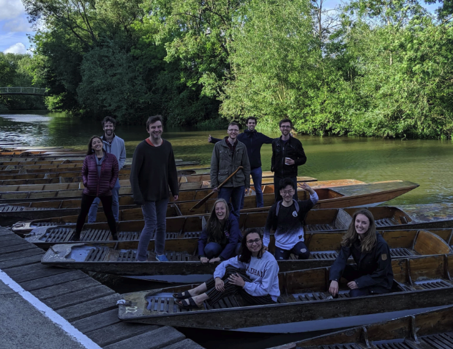

# Labs focusing on cognitive modeling

## Stanford University 

### _Social Learning Lab_

```{r, fig.cap="Social Learning Lab", echo=FALSE}

```
Lab Website: <http://sll.stanford.edu/>

Principle Investigator: `Hyowon Gweon`

Google Scholar Citation: `2811`

Post Open Positions: `YES`

Research Theme: `We learn about the world by drawing rich, abstract inductive inferences that go beyond what we can observe, and much of these observations come from behaviors of others around us. By engaging in social learning in diverse contexts, humans learn from others, share their knowledge with others, and even accumulate a body of cultural knowledge over generations.`

## Brown University

### Shenhav Lab

```{r, fig.cap="Shenhav Lab", echo=FALSE}
knitr::include_graphics("shenhavlab.png")
```
Lab Website: <https://www.shenhavlab.org/>

Principle Investigator: `Amitai Shenhav`

Google Scholar Citation: `5478`

Post Open Positions: `YES _(did not say whether should contact in email)_`

Research Theme: `**Decision-making** research focuses on how we deliberate over costs and benefits of our options (e.g., comparing apples & oranges). **Cognitive control** research focuses on how we exert cognitive effort to overcome our automatic biases (e.g., naming the color a word appears in vs. reading the word itself).`

Representative Papers:

1. As professor:

    - *Frömer, R, *Lin, H., Dean Wolf, C.K., Inzlicht, M. & Shenhav, A. (2021). Expectations of reward and efficacy guide cognitive control allocation. Nature Communications, 12: 1030.
    - Ritz, H., Frömer, R., & Shenhav, A. (2020). Bridging Motor and Cognitive Control: It’s About Time! Trends in Cognitive Sciences, 24(1): 6-8.
    - Frömer, R., Dean Wolf, C.K., & Shenhav, A. (2019). Goal congruency dominates reward value in accounting for behavioral and neural correlates of value-based decision-making. Nature Communications, 10(1): 4926.

1. As student:

    - Shenhav, A., Botvinick, M.M., & Cohen, J.D. (2016). Dorsal anterior cingulate cortex and the value of control. Nature Neuroscience 19(10): 1286-1291.
    - Shenhav, A., Straccia, M.A., Cohen, J.D., & Botvinick, M.M. (2014). Anterior cingulate engagement in a foraging context reflects choice difficulty, not foraging value. Nature Neuroscience 17(9): 1249-1254.
    
## Oxford University

### ACClab

```{r, fig.cap="ACClab", echo=FALSE}
knitr::include_graphics("acclab.png")
```
Lab Website: <https://www.oxacclab.org/>

Principle Investigator: `Nick Yeung`

Google Scholar Citation: `14887`

Post Open Positions: `YES _(encourage contact)_`

Research Theme: `The broad question addressed in our research is how coherent thought and action emerge from processing in the brain. While much is now known about specific aspects of brain function—how we perceive the world, attend to particular details, remember facts and events, make decisions, etc.—much less is known about how these different functions become organised so that, at any given time, we can focus our attention on a particular task (or tasks) based on our current goals and intentions. Our research investigates the mechanisms responsible for imposing this organisation on our thoughts and actions. A key component of our research is the development of computational models of attention and control processes. We use these models to inform the design and interpretation of our empirical work that combines behavioural, functional neuroimaging (fMRI), and scalp electrophysiological (EEG) methods.`

Representative Papers:

1. As professor:

    - Frömer, R., Nassar, M. R., Bruckner, R., Stürmer, B., Sommer, W., & Yeung, N. (2021). Response-based outcome predictions and confidence regulate feedback processing and learning. Elife, 10, e62825.
    - Desender, K., Murphy, P., Boldt, A., Verguts, T., & Yeung, N. (2019). A postdecisional neural marker of confidence predicts Information-Seeking in Decision-Making. Journal of Neuroscience, 39(17), 3309-3319.
    - Sutterer, D. W., Foster, J. J., Adam, K. C., Vogel, E. K., & Awh, E. (2019). Item-specific delay activity demonstrates concurrent storage of multiple active neural representations in working memory. PLoS biology, 17(4), e3000239.
    - Desender, K., Boldt, A., & Yeung, N. (2018). Subjective confidence predicts information seeking in decision making. Psychological science, 29(5), 761-778.
    - Boldt, A., & Yeung, N. (2015). Shared neural markers of decision confidence and error detection. Journal of Neuroscience, 35(8), 3478-3484.
    
1. As student:

    - Yeung, N., Botvinick, M. M., & Cohen, J. D. (2004). The neural basis of error detection: conflict monitoring and the error-related negativity. Psychological review, 111(4), 931.
    - Yeung, N., & Sanfey, A. G. (2004). Independent coding of reward magnitude and valence in the human brain. Journal of Neuroscience, 24(28), 6258-6264.
    - Yeung, N., Holroyd, C. B., & Cohen, J. D. (2005). ERP correlates of feedback and reward processing in the presence and absence of response choice. Cerebral cortex, 15(5), 535-544.
    
### Human Information Processing Lab

```{r, fig.cap="Summerfield Lab", echo=FALSE}

```
Lab Website: <https://humaninformationprocessing.com/>

Principle Investigator: `Christopher Summerfirld`

Google Scholar Citation: `12223`

Post Open Positions: `YES (encourage contact)`

Research Theme: `My work is concerned with understanding how humans learn and make decisions. We study learning in adults using computer-based tasks. We are interested in how humans acquire new concepts or patterns in data, and how they use this information to make decisions in novel settings.  We simulate learning processes using computational models, including deep neural nettworks, that are tasked with similar challenges. We study the brains of humans during learning and decision-making using noninvasive methods such as fMRI and EEG.`

Representative Papers:

1. As professor:

    - Sheahan, H., Luyckx, F., Nelli, S., Teupe, C., & Summerfield, C. (2021). Neural state space alignment for magnitude generalization in humans and recurrent networks. Neuron, 109(7), 1214-1226.
    - Juechems, K., Balaguer, J., Spitzer, B., & Summerfield, C. (2021). Optimal utility and probability functions for agents with finite computational precision. Proceedings of the National Academy of Sciences, 118(2).
    - Dumbalska, T., Li, V., Tsetsos, K., & Summerfield, C. (2020). A map of decoy influence in human multialternative choice. Proceedings of the National Academy of Sciences, 117(40), 25169-25178.
    - Castañón, S. H., Moran, R., Ding, J., Egner, T., Bang, D., & Summerfield, C. (2019). Human noise blindness drives suboptimal cognitive inference. Nature communications, 10(1), 1-11.
    - Flesch, T., Balaguer, J., Dekker, R., Nili, H., & Summerfield, C. (2018). Comparing continual task learning in minds and machines. Proceedings of the National Academy of Sciences, 115(44), E10313-E10322.
    - Li, V., Michael, E., Balaguer, J., Castañón, S. H., & Summerfield, C. (2018). Gain control explains the effect of distraction in human perceptual, cognitive, and economic decision making. Proceedings of the National Academy of Sciences, 115(38), E8825-E8834.
    
1. As student:

    - Summerfield, C., & Koechlin, E. (2008). A neural representation of prior information during perceptual inference. Neuron, 59(2), 336-347.
    - Summerfield, C., Trittschuh, E. H., Monti, J. M., Mesulam, M. M., & Egner, T. (2008). Neural repetition suppression reflects fulfilled perceptual expectations. Nature neuroscience, 11(9), 1004-1006.
    - Summerfield, C., Egner, T., Greene, M., Koechlin, E., Mangels, J., & Hirsch, J. (2006). Predictive codes for forthcoming perception in the frontal cortex. Science, 314(5803), 1311-1314.
    
## ÉCOLE NORMALE SUPÉRIEURE (巴黎高等师范)

### The HUman Reinforcement Learning team

```{r, fig.cap="Palminteri Lab", echo=FALSE}
knitr::include_graphics("Palminterilab.png")
```
Lab Website: <https://sites.google.com/site/stefanopalminteri/hrl-team>

Principle Investigator: `Stefano Palminteri`

Google Scholar Citation: `2539`

Post Open Positions: `YES` [Website for offers](https://lnc2.dec.ens.fr/en/jobs)

Research Theme: `My goal is understanding how humans learn to make decisions at the behavioral, computational and neural levels. I am mainly (but not only!) interested in situations when decisions are based on past experience (a.k.a. reinforcement learning) . My modus operandi consists in modifying reinforcement learning models, so that they can account for human behavior (in other terms, although my work involves  building and testing formal models, I still define myself as an experimentalist). In the last few years I mainly investigated two  research hypotheses concerning human reinforcement learning: 1. value is learned in a relative scale 2. value is learned in a biased manner  In addition to extending the "relative value" and the "learning bias" frameworks, new lines of research in my team investigate  social learning and the experience/description gap.  `

Representative Papers:

1. As professor:

    - Palminteri, S., & Lebreton, M. (2021). Context-dependent outcome encoding in human reinforcement learning. Current Opinion in Behavioral Science.
    - Bavard, S., Rustichini, A., & Palminteri, S. (2021). Two sides of the same coin: Beneficial and detrimental consequences of range adaptation in human reinforcement learning. Science Advances, 7(14), eabe0340
    - Najar, A., Bonnet, E., Bahrami, B., & Palminteri, S. (2020). The actions of others act as a pseudo-reward to drive imitation in the context of social reinforcement learning. PLoS biology, 18(12), e3001028.
    - Castañón, S. H., Moran, R., Ding, J., Egner, T., Bang, D., & Summerfield, C. (2019). Human noise blindness drives suboptimal cognitive inference. Nature communications, 10(1), 1-11.
    - Chambon, V., Théro, H., Vidal, M., Vandendriessche, H., Haggard, P., & Palminteri, S. (2020). Information about action outcomes differentially affects learning from self-determined versus imposed choices. Nature Human Behaviour, 4(10), 1067-1079.
    - Lebreton, M., Bavard, S., Daunizeau, J., & Palminteri, S. (2019). Assessing inter-individual differences with task-related functional neuroimaging. Nature Human Behaviour, 3(9), 897-905.
    - Lefebvre, G., Nioche, A., Bourgeois-Gironde, S., & Palminteri, S. (2018). Contrasting temporal difference and opportunity cost reinforcement learning in an empirical money-emergence paradigm. Proceedings of the National Academy of Sciences, 115(49), E11446-E11454.
    - Bavard, S., Lebreton, M., Khamassi, M., Coricelli, G., & Palminteri, S. (2018). Reference-point centering and range-adaptation enhance human reinforcement learning at the cost of irrational preferences. Nature communications, 9(1), 1-12.
    
1. As student:

    - Palminteri, S., Lebreton, M., Worbe, Y., Grabli, D., Hartmann, A., & Pessiglione, M. (2009). Pharmacological modulation of subliminal learning in Parkinson's and Tourette's syndromes. Proceedings of the National Academy of Sciences, 106(45), 19179-19184.
    - Palminteri, S., Boraud, T., Lafargue, G., Dubois, B., & Pessiglione, M. (2009). Brain hemispheres selectively track the expected value of contralateral options. Journal of Neuroscience, 29(43), 13465-13472.
    - Palminteri, S., Lebreton, M., Worbe, Y., Hartmann, A., Lehéricy, S., Vidailhet, M., ... & Pessiglione, M. (2011). Dopamine-dependent reinforcement of motor skill learning: evidence from Gilles de la Tourette syndrome. Brain, 134(8), 2287-2301.
    - Palminteri, S., Clair, A. H., Mallet, L., & Pessiglione, M. (2012). Similar improvement of reward and punishment learning by serotonin reuptake inhibitors in obsessive-compulsive disorder. Biological psychiatry, 72(3), 244-250.
    - Palminteri, S., Justo, D., Jauffret, C., Pavlicek, B., Dauta, A., Delmaire, C., ... & Pessiglione, M. (2012). Critical roles for anterior insula and dorsal striatum in punishment-based avoidance learning. Neuron, 76(5), 998-1009.
    - Palminteri, S., Khamassi, M., Joffily, M., & Coricelli, G. (2015). Contextual modulation of value signals in reward and punishment learning. Nature communications, 6(1), 1-14.
    - Palminteri, S., Kilford, E. J., Coricelli, G., & Blakemore, S. J. (2016). The computational development of reinforcement learning during adolescence. PLoS computational biology, 12(6), e1004953.
