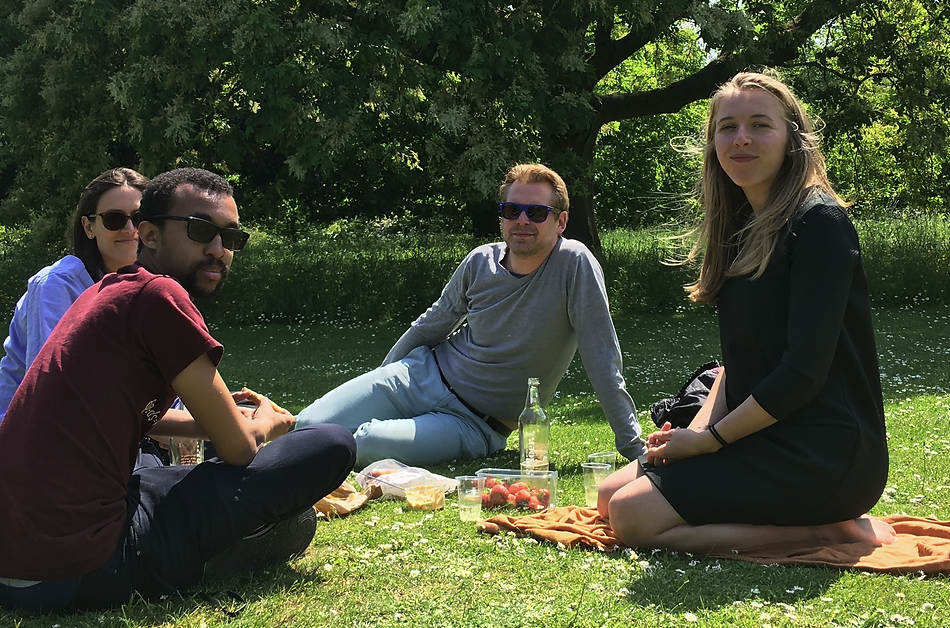
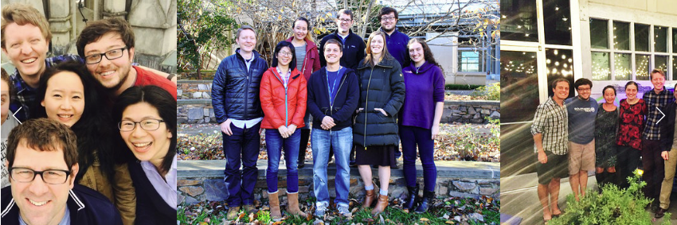

--- 
title: "Lab Selection for PhD Application"
author: "Yifei Cao"
date: "`r Sys.Date()`"
site: bookdown::bookdown_site
---

# Labs focusing on neuroimaging techniques

## Stanford University 

### _Poldrack Lab_

```{r, fig.cap="Poldrack Lab", echo=FALSE}
knitr::include_graphics("PoldrackLab.png")
```
Lab Website: <https://poldracklab.stanford.edu/>

Principle Investigator: `Russell Poldrack`

Google Scholar Citation: `65008`

Post Open Positions: `NO`

Research Theme: `Our lab uses the tools of cognitive neuroscience to understand how decision making, executive control, and learning and memory are implemented in the human brain.`


## Dartmouth College

### Functional Imaging and Naturalistic Neuroscience Lab

```{r, fig.cap="Finn Lab", echo=FALSE}
knitr::include_graphics("finnlab.png")
```
Lab Website: <https://thefinnlab.github.io/>

Principle Investigator: `Emily S, Finn`

Google Scholar Citation: `4298`

Post Open Positions: `YES`

Research Theme: `What makes us unique? How do our intrinsic traits bias our perceptions and judgments, and how is this reflected in patterns of brain activity? Why might different people arrive at different interpretations of the same experience? My lab’s research combines behavioral, neuroimaging and computational techniques to study individual differences in cognition, especially under rich, dynamic, “naturalistic” stimulation such as watching movies or listening to stories. We are particularly interested in how individuals resolve ambiguity in narratives, and how this process varies with trait- and state-level factors.`

Representative Papers:

1. As professor:

    - Bandettini, P. A., Huber, L., & Finn, E. S. (2021). Challenges and opportunities of mesoscopic brain mapping with fMRI. Current Opinion in Behavioral Sciences, 40, 189-200.
    - Finn, E. S. (2021). Is it time to put rest to rest?. Trends in Cognitive Sciences.

1. As student:

    - **Finn ES**, Shen X, Scheinost D, Rosenberg MD, Huang J, Chun MM, Papademetris X, Constable RT. (2015) Functional connectome fingerprinting: Identifying individuals using patterns of brain connectivity. Nature Neuroscience, 18: 1664–1671.
    - Finn ES, Corlett PR, Chen G, Bandettini PA, Constable RT. (2018). Trait paranoia shapes inter-subject synchrony in brain activity during an ambiguous social narrative. Nature Communications, 9: 2043.
    - Finn ES, Huber L, Jangraw DC, Molfese PJ, Bandettini PA. (2019). Layer-dependent activity in human prefrontal cortex during working memory. Nature Neuroscience, 22: 1687–1695.


## University of Chicago

### Cognitive Neuroscience Lab

```{r, fig.cap="Awh Lab", echo=FALSE}
knitr::include_graphics("awhlab.png")
```
Lab Website: <https://awhvogellab.com/>

Principle Investigator: `Edward Awh`

Google Scholar Citation: `19158`

Post Open Positions: `NO`

Research Theme: `We study the interactions between visual working memory and selective attention using psychophysical and electrophysiological methods.`

Representative Papers:

1. As professor:

    - Feldmann-Wüstefeld, T., Weinberger, M., & Awh, E. (2021). Spatially guided distractor suppression during visual search. Journal of Neuroscience, 41(14), 3180-3191.
    - Foster, J. J., Thyer, W., Wennberg, J. W., & Awh, E. (2021). Covert attention increases the gain of stimulus-evoked population codes. Journal of Neuroscience, 41(8), 1802-1815.
    - Sutterer, D. W., Foster, J. J., Adam, K. C., Vogel, E. K., & Awh, E. (2019). Item-specific delay activity demonstrates concurrent storage of multiple active neural representations in working memory. PLoS biology, 17(4), e3000239.
    - Foster, J. J., Bsales, E. M., Jaffe, R. J., & Awh, E. (2017). Alpha-band activity reveals spontaneous representations of spatial position in visual working memory. Current Biology, 27(20), 3216-3223.
    - Awh, E., Belopolsky, A. V., & Theeuwes, J. (2012). Top-down versus bottom-up attentional control: A failed theoretical dichotomy. Trends in cognitive sciences, 16(8), 437-443.
    
1. As student:

    - Awh, E., & Jonides, J. (2001). Overlapping mechanisms of attention and spatial working memory. Trends in cognitive sciences, 5(3), 119-126.
    - Awh, E., Jonides, J., Smith, E. E., Schumacher, E. H., Koeppe, R. A., & Katz, S. (1996). Dissociation of storage and rehearsal in verbal working memory: Evidence from positron emission tomography. Psychological Science, 7(1), 25-31.
    - Awh, E., Belopolsky, A. V., & Theeuwes, J. (2012). Top-down versus bottom-up attentional control: A failed theoretical dichotomy. Trends in cognitive sciences, 16(8), 437-443.
    
## Oxford University
    
### Brain & Cognition Lab

```{r, fig.cap="Nobre Lab", echo=FALSE}
knitr::include_graphics("nobrelab.png")
```
Lab Website: <https://www.brainandcognition.org/>

Principle Investigator: `Kia Nobre`

Google Scholar Citation: `32459`

Post Open Positions: `YES _(encourage contact)_`

Research Theme: `Human behaviour is uniquely flexible. Our brains bring forth memories from moments to years ago, taking into account what matters in a given context, to guide our perception, choice, action, and learning. All of this happens in the flux of our ongoing interaction with the external environment and internal mindscape. In the lab, we are fascinated by this proactive and dynamic process of focus at the core of all cognition. We carry out many lines of research, but they share the broad aim of investigating the workings of mental focus and in understanding its role in psychological and brain disorders.`

Representative Papers:

1. Recent publication:

    - van Ede, F., Deden, J., & Nobre, A. C. (2021). Looking ahead in working memory to guide sequential behaviour. Current Biology, 31(12), R779-R780.
    - Draschkow, D., Kallmayer, M., & Nobre, A. C. (2021). When natural behavior engages working memory. Current Biology, 31(4), 869-874.
    - Van Ede, F., Board, A. G., & Nobre, A. C. (2020). Goal-directed and stimulus-driven selection of internal representations. Proceedings of the National Academy of Sciences, 117(39), 24590-24598.
    - Bauer, A. K. R., Debener, S., & Nobre, A. C. (2020). Synchronisation of neural oscillations and cross-modal influences. Trends in cognitive sciences, 24(6), 481-495.
    - Van Ede, F., Chekroud, S. R., & Nobre, A. C. (2019). Human gaze tracks attentional focusing in memorized visual space. Nature human behaviour, 3(5), 462-470.
    
1. Early period:

    - Nobre, A. C., Allison, T., & McCarthy, G. (1994). Word recognition in the human inferior temporal lobe. Nature, 372(6503), 260-263.
    - Nobre, A. C., Gitelman, D. R., Dias, E. C., & Mesulam, M. M. (2000). Covert visual spatial orienting and saccades: overlapping neural systems. Neuroimage, 11(3), 210-216.
    - Nobre, A. C., Coull, J. T., Frith, C. D., & Mesulam, M. M. (1999). Orbitofrontal cortex is activated during breaches of expectation in tasks of visual attention. Nature neuroscience, 2(1), 11-12.

## Donders Institute (Netherland)

### Lifespan Cognitive Dynamics Lab

```{r, fig.cap="kievit Lab", echo=FALSE}

```
Lab Website: <https://www.rogierkievit.com/>

Principle Investigator: `Rogier Kievit`

Google Scholar Citation: `6534`

Post Open Positions: `YES (encourage contact)`

Research Theme: `A striking feature of individual differences in cognitive abilities is that they are universally positively correlated – a phenomenon known as the positive manifold. The traditional method of analysis yields a g-factor, a single summary metric with considerable predictive power. However, this summary metric ignores the developmental origin of the positive manifold. Multiple competing accounts of the origin of the g factor have been proposed, but in the absence of tailored longitudinal data these models cannot be empirically distinguished. One such model, the mutualism model, proposes that positive interactions between cognitive domains facilitate mutual growth. In three different projects we have shown that this model can help explain cognitive development in childhood. We are currently working on various extensions of these findings.`

Representative Papers:

1. Recent publication:

    - de Mooij, S. M., Henson, R. N., Waldorp, L. J., & Kievit, R. A. (2018). Age differentiation within gray matter, white matter, and between memory and white matter in an adult life span cohort. Journal of Neuroscience, 38(25), 5826-5836.
    - Simpson-Kent, I. L., Fuhrmann, D., Bathelt, J., Achterberg, J., Borgeest, G. S., & Kievit, R. A. (2020). Neurocognitive reorganization between crystallized intelligence, fluid intelligence and white matter microstructure in two age-heterogeneous developmental cohorts. Developmental cognitive neuroscience, 41, 100743.
    - Liu, K. Y., Kievit, R. A., Tsvetanov, K. A., Betts, M. J., Düzel, E., Rowe, J. B., ... & Hämmerer, D. (2020). Noradrenergic-dependent functions are associated with age-related locus coeruleus signal intensity differences. Nature communications, 11(1), 1-9.
    - Kievit, R. A., Brandmaier, A. M., Ziegler, G., van Harmelen, A. L., de Mooij, S. M., Moutoussis, M., ... & NSPN Consortium. (2018). Developmental cognitive neuroscience using latent change score models: A tutorial and applications. Developmental cognitive neuroscience, 33, 99-117.
    
1. Early period:

    - Kievit, R. A., Davis, S. W., Mitchell, D. J., Taylor, J. R., Duncan, J., & Henson, R. N. (2014). Distinct aspects of frontal lobe structure mediate age-related differences in fluid intelligence and multitasking. Nature communications, 5(1), 1-10.
    - Kievit, R., Frankenhuis, W. E., Waldorp, L., & Borsboom, D. (2013). Simpson's paradox in psychological science: a practical guide. Frontiers in psychology, 4, 513.
    - Kriegeskorte, N., & Kievit, R. A. (2013). Representational geometry: integrating cognition, computation, and the brain. Trends in cognitive sciences, 17(8), 401-412.
    
## Duke University

### Egner Lab

```{r, fig.cap="Egner Lab", echo=FALSE}

```
Lab Website: <http://www.egnerlab.org/>

Principle Investigator: `Tobias Egner`

Google Scholar Citation: `18933`

Post Open Positions: `NO`

Research Theme: `One core interest of our lab concerns how the human brain exploits prior experience and current context to predict forthcoming stimuli in adaptive visual cognition. Another major line of research investigates how we strategically adapt our cognitive processing strategies to changing circumstances, known as the study of cognitive control.`

Representative Papers:

1. Recent publication:

    - Yin, S., Bi, T., Chen, A., & Egner, T. (2021). Ventromedial prefrontal cortex drives the prioritization of self-associated stimuli in working memory. Journal of Neuroscience, 41(9), 2012-2023.
    - Braem, S., Bugg, J. M., Schmidt, J. R., Crump, M. J., Weissman, D. H., Notebaert, W., & Egner, T. (2019). Measuring adaptive control in conflict tasks. Trends in Cognitive Sciences, 23(9), 769-783. microstructure in two age-heterogeneous developmental cohorts. Developmental cognitive neuroscience, 41, 100743.
    - Chiu, Y. C., & Egner, T. (2019). Cortical and subcortical contributions to context-control learning. Neuroscience & Biobehavioral Reviews, 99, 33-41.
    - Jiang, J., Wagner, A. D., & Egner, T. (2018). Integrated externally and internally generated task predictions jointly guide cognitive control in prefrontal cortex. ELife, 7, e39497.
    - Kiyonaga, A., & Egner, T. (2016). Center-surround inhibition in working memory. Current Biology, 26(1), 64-68.
    - Jiang, J., Beck, J., Heller, K., & Egner, T. (2015). An insula-frontostriatal network mediates flexible cognitive control by adaptively predicting changing control demands. Nature Communications, 6(1), 1-11.
    
1. Early period:

    - Egner, T., & Hirsch, J. (2005). The neural correlates and functional integration of cognitive control in a Stroop task. Neuroimage, 24(2), 539-547.e mediate age-related differences in fluid intelligence and multitasking. Nature communications, 5(1), 1-10.
    - Egner, T. (2007). Congruency sequence effects and cognitive control. Cognitive, Affective, & Behavioral Neuroscience, 7(4), 380-390.
    - Egner, T., & Hirsch, J. (2005). Cognitive control mechanisms resolve conflict through cortical amplification of task-relevant information. Nature neuroscience, 8(12), 1784-1790.
    - Egner, T. (2008). Multiple conflict-driven control mechanisms in the human brain. Trends in cognitive sciences, 12(10), 374-380.
    - Egner, T., Jamieson, G., & Gruzelier, J. (2005). Hypnosis decouples cognitive control from conflict monitoring processes of the frontal lobe. Neuroimage, 27(4), 969-978.