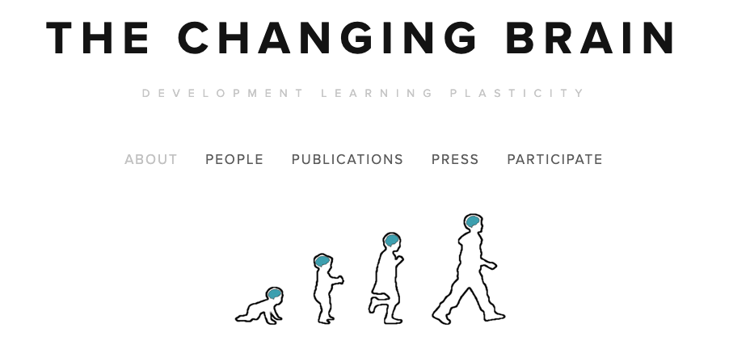
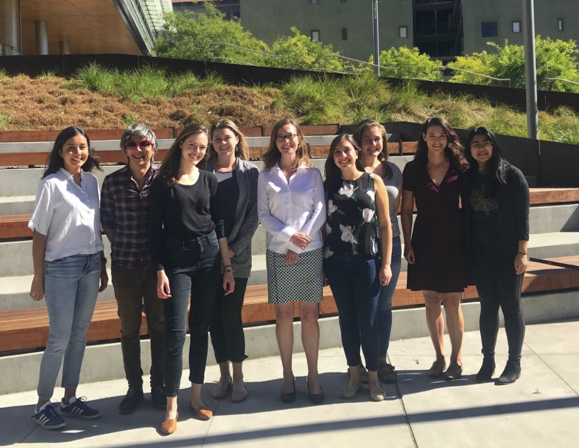
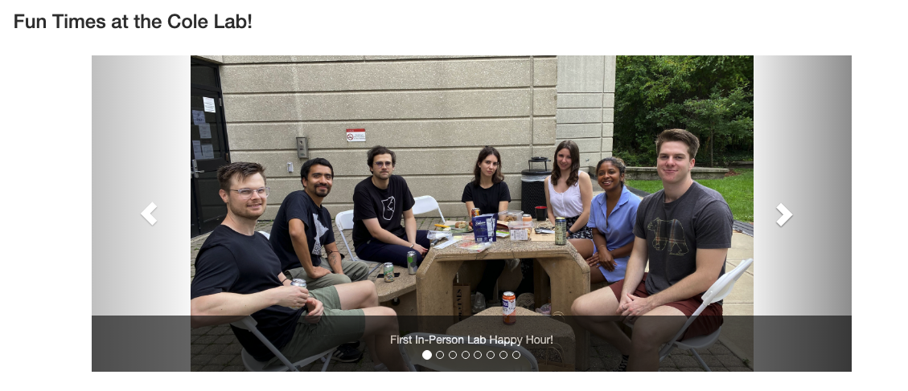

--- 
title: "Lab Selection for PhD Application"
author: "Yifei Cao"
date: "`r Sys.Date()`"
site: bookdown::bookdown_site
---

# Labs using neuroimaging techniques

## MIT McGovern Institute

### Gabrieli Lab

```{r, fig.cap="Gabrieli Lab", echo=FALSE}

```
Lab Website: <https://gablab.mit.edu/>

Principle Investigator: `John Gabrieli`

Google Scholar Citation: `89516`

Post Open Positions: `No (but encourage contacting)`

Research Theme: `John Gabrieli’s goal is to understand the organization of memory, thought, and emotion in the human brain, and to use that understanding to help people live happier, more productive lives. By combining brain imaging with behavioral tests, he studies the neural basis of these abilities in human subjects. One important research theme is to understand the neural basis of learning in children and to identify ways that neuroscience could help to improve learning in the classroom. In collaboration with clinical colleagues, Gabrieli also seeks to use brain imaging to better understand, diagnose, and select treatments for neurological and psychiatric diseases.`

Representative Papers:

1. Recent publications:

    - Rozenkrantz, L., D’Mello, A. M., & Gabrieli, J. D. (2021). Enhanced rationality in autism spectrum disorder. Trends in cognitive sciences.
    - Romeo, R. R., Segaran, J., Leonard, J. A., Robinson, S. T., West, M. R., Mackey, A. P., ... & Gabrieli, J. D. (2018). Language exposure relates to structural neural connectivity in childhood. Journal of Neuroscience, 38(36), 7870-7877.
    - Romeo, R. R., Christodoulou, J. A., Halverson, K. K., Murtagh, J., Cyr, A. B., Schimmel, C., ... & Gabrieli, J. D. (2018). Socioeconomic status and reading disability: Neuroanatomy and plasticity in response to intervention. Cerebral Cortex, 28(7), 2297-2312.

1. Early publications:

    - Ochsner, K. N., Bunge, S. A., Gross, J. J., & Gabrieli, J. D. (2002). Rethinking feelings: an FMRI study of the cognitive regulation of emotion. Journal of cognitive neuroscience, 14(8), 1215-1229.
    - Hedden, T., & Gabrieli, J. D. (2004). Insights into the ageing mind: a view from cognitive neuroscience. Nature reviews neuroscience, 5(2), 87-96.
    - Poldrack, R. A., Wagner, A. D., Prull, M. W., Desmond, J. E., Glover, G. H., & Gabrieli, J. D. (1999). Functional specialization for semantic and phonological processing in the left inferior prefrontal cortex. Neuroimage, 10(1), 15-35.
    - Bunge, S. A., Dudukovic, N. M., Thomason, M. E., Vaidya, C. J., & Gabrieli, J. D. (2002). Immature frontal lobe contributions to cognitive control in children: evidence from fMRI. Neuron, 33(2), 301-311.
    - Brewer, J. B., Zhao, Z., Desmond, J. E., Glover, G. H., & Gabrieli, J. D. (1998). Making memories: brain activity that predicts how well visual experience will be remembered. Science, 281(5380), 1185-1187.
    - Anderson, M. C., Ochsner, K. N., Kuhl, B., Cooper, J., Robertson, E., Gabrieli, S. W., ... & Gabrieli, J. D. (2004). Neural systems underlying the suppression of unwanted memories. Science, 303(5655), 232-235.


## Stanford University 

### _Poldrack Lab_

```{r, fig.cap="Poldrack Lab", echo=FALSE}
knitr::include_graphics("PoldrackLab.png")
```
Lab Website: <https://poldracklab.stanford.edu/>

Principle Investigator: `Russell Poldrack`

Google Scholar Citation: `65008`

Post Open Positions: `NO`

Research Theme: `Our lab uses the tools of cognitive neuroscience to understand how decision making, executive control, and learning and memory are implemented in the human brain.`


## Dartmouth College

### Functional Imaging and Naturalistic Neuroscience Lab

```{r, fig.cap="Finn Lab", echo=FALSE}
knitr::include_graphics("finnlab.png")
```
Lab Website: <https://thefinnlab.github.io/>

Principle Investigator: `Emily S, Finn`

Google Scholar Citation: `4298`

Post Open Positions: `YES`

Research Theme: `What makes us unique? How do our intrinsic traits bias our perceptions and judgments, and how is this reflected in patterns of brain activity? Why might different people arrive at different interpretations of the same experience? My lab’s research combines behavioral, neuroimaging and computational techniques to study individual differences in cognition, especially under rich, dynamic, “naturalistic” stimulation such as watching movies or listening to stories. We are particularly interested in how individuals resolve ambiguity in narratives, and how this process varies with trait- and state-level factors.`

Representative Papers:

1. As professor:

    - Bandettini, P. A., Huber, L., & Finn, E. S. (2021). Challenges and opportunities of mesoscopic brain mapping with fMRI. Current Opinion in Behavioral Sciences, 40, 189-200.
    - Finn, E. S. (2021). Is it time to put rest to rest?. Trends in Cognitive Sciences.

1. As student:

    - **Finn ES**, Shen X, Scheinost D, Rosenberg MD, Huang J, Chun MM, Papademetris X, Constable RT. (2015) Functional connectome fingerprinting: Identifying individuals using patterns of brain connectivity. Nature Neuroscience, 18: 1664–1671.
    - Finn ES, Corlett PR, Chen G, Bandettini PA, Constable RT. (2018). Trait paranoia shapes inter-subject synchrony in brain activity during an ambiguous social narrative. Nature Communications, 9: 2043.
    - Finn ES, Huber L, Jangraw DC, Molfese PJ, Bandettini PA. (2019). Layer-dependent activity in human prefrontal cortex during working memory. Nature Neuroscience, 22: 1687–1695.


## University of Chicago

### Cognitive Neuroscience Lab

```{r, fig.cap="Awh Lab", echo=FALSE}
knitr::include_graphics("awhlab.png")
```
Lab Website: <https://awhvogellab.com/>

Principle Investigator: `Edward Awh`

Google Scholar Citation: `19158`

Post Open Positions: `NO`

Research Theme: `We study the interactions between visual working memory and selective attention using psychophysical and electrophysiological methods.`

Representative Papers:

1. As professor:

    - Feldmann-Wüstefeld, T., Weinberger, M., & Awh, E. (2021). Spatially guided distractor suppression during visual search. Journal of Neuroscience, 41(14), 3180-3191.
    - Foster, J. J., Thyer, W., Wennberg, J. W., & Awh, E. (2021). Covert attention increases the gain of stimulus-evoked population codes. Journal of Neuroscience, 41(8), 1802-1815.
    - Sutterer, D. W., Foster, J. J., Adam, K. C., Vogel, E. K., & Awh, E. (2019). Item-specific delay activity demonstrates concurrent storage of multiple active neural representations in working memory. PLoS biology, 17(4), e3000239.
    - Foster, J. J., Bsales, E. M., Jaffe, R. J., & Awh, E. (2017). Alpha-band activity reveals spontaneous representations of spatial position in visual working memory. Current Biology, 27(20), 3216-3223.
    - Awh, E., Belopolsky, A. V., & Theeuwes, J. (2012). Top-down versus bottom-up attentional control: A failed theoretical dichotomy. Trends in cognitive sciences, 16(8), 437-443.
    
1. As student:

    - Awh, E., & Jonides, J. (2001). Overlapping mechanisms of attention and spatial working memory. Trends in cognitive sciences, 5(3), 119-126.
    - Awh, E., Jonides, J., Smith, E. E., Schumacher, E. H., Koeppe, R. A., & Katz, S. (1996). Dissociation of storage and rehearsal in verbal working memory: Evidence from positron emission tomography. Psychological Science, 7(1), 25-31.
    - Awh, E., Belopolsky, A. V., & Theeuwes, J. (2012). Top-down versus bottom-up attentional control: A failed theoretical dichotomy. Trends in cognitive sciences, 16(8), 437-443.
    
## Oxford University
    
### Brain & Cognition Lab

```{r, fig.cap="Nobre Lab", echo=FALSE}
knitr::include_graphics("nobrelab.png")
```
Lab Website: <https://www.brainandcognition.org/>

Principle Investigator: `Kia Nobre`

Google Scholar Citation: `32459`

Post Open Positions: `YES _(encourage contact)_`

Research Theme: `Human behaviour is uniquely flexible. Our brains bring forth memories from moments to years ago, taking into account what matters in a given context, to guide our perception, choice, action, and learning. All of this happens in the flux of our ongoing interaction with the external environment and internal mindscape. In the lab, we are fascinated by this proactive and dynamic process of focus at the core of all cognition. We carry out many lines of research, but they share the broad aim of investigating the workings of mental focus and in understanding its role in psychological and brain disorders.`

Representative Papers:

1. Recent publication:

    - van Ede, F., Deden, J., & Nobre, A. C. (2021). Looking ahead in working memory to guide sequential behaviour. Current Biology, 31(12), R779-R780.
    - Draschkow, D., Kallmayer, M., & Nobre, A. C. (2021). When natural behavior engages working memory. Current Biology, 31(4), 869-874.
    - Van Ede, F., Board, A. G., & Nobre, A. C. (2020). Goal-directed and stimulus-driven selection of internal representations. Proceedings of the National Academy of Sciences, 117(39), 24590-24598.
    - Bauer, A. K. R., Debener, S., & Nobre, A. C. (2020). Synchronisation of neural oscillations and cross-modal influences. Trends in cognitive sciences, 24(6), 481-495.
    - Van Ede, F., Chekroud, S. R., & Nobre, A. C. (2019). Human gaze tracks attentional focusing in memorized visual space. Nature human behaviour, 3(5), 462-470.
    
1. Early period:

    - Nobre, A. C., Allison, T., & McCarthy, G. (1994). Word recognition in the human inferior temporal lobe. Nature, 372(6503), 260-263.
    - Nobre, A. C., Gitelman, D. R., Dias, E. C., & Mesulam, M. M. (2000). Covert visual spatial orienting and saccades: overlapping neural systems. Neuroimage, 11(3), 210-216.
    - Nobre, A. C., Coull, J. T., Frith, C. D., & Mesulam, M. M. (1999). Orbitofrontal cortex is activated during breaches of expectation in tasks of visual attention. Nature neuroscience, 2(1), 11-12.

## Donders Institute (Netherland)

### Lifespan Cognitive Dynamics Lab

```{r, fig.cap="kievit Lab", echo=FALSE}
knitr::include_graphics("kievitlab.png")
```
Lab Website: <https://www.rogierkievit.com/>

Principle Investigator: `Rogier Kievit`

Google Scholar Citation: `6534`

Post Open Positions: `YES (encourage contact)`

Research Theme: `A striking feature of individual differences in cognitive abilities is that they are universally positively correlated – a phenomenon known as the positive manifold. The traditional method of analysis yields a g-factor, a single summary metric with considerable predictive power. However, this summary metric ignores the developmental origin of the positive manifold. Multiple competing accounts of the origin of the g factor have been proposed, but in the absence of tailored longitudinal data these models cannot be empirically distinguished. One such model, the mutualism model, proposes that positive interactions between cognitive domains facilitate mutual growth. In three different projects we have shown that this model can help explain cognitive development in childhood. We are currently working on various extensions of these findings.`

Representative Papers:

1. Recent publication:

    - de Mooij, S. M., Henson, R. N., Waldorp, L. J., & Kievit, R. A. (2018). Age differentiation within gray matter, white matter, and between memory and white matter in an adult life span cohort. Journal of Neuroscience, 38(25), 5826-5836.
    - Simpson-Kent, I. L., Fuhrmann, D., Bathelt, J., Achterberg, J., Borgeest, G. S., & Kievit, R. A. (2020). Neurocognitive reorganization between crystallized intelligence, fluid intelligence and white matter microstructure in two age-heterogeneous developmental cohorts. Developmental cognitive neuroscience, 41, 100743.
    - Liu, K. Y., Kievit, R. A., Tsvetanov, K. A., Betts, M. J., Düzel, E., Rowe, J. B., ... & Hämmerer, D. (2020). Noradrenergic-dependent functions are associated with age-related locus coeruleus signal intensity differences. Nature communications, 11(1), 1-9.
    - Kievit, R. A., Brandmaier, A. M., Ziegler, G., van Harmelen, A. L., de Mooij, S. M., Moutoussis, M., ... & NSPN Consortium. (2018). Developmental cognitive neuroscience using latent change score models: A tutorial and applications. Developmental cognitive neuroscience, 33, 99-117.
    
1. Early period:

    - Kievit, R. A., Davis, S. W., Mitchell, D. J., Taylor, J. R., Duncan, J., & Henson, R. N. (2014). Distinct aspects of frontal lobe structure mediate age-related differences in fluid intelligence and multitasking. Nature communications, 5(1), 1-10.
    - Kievit, R., Frankenhuis, W. E., Waldorp, L., & Borsboom, D. (2013). Simpson's paradox in psychological science: a practical guide. Frontiers in psychology, 4, 513.
    - Kriegeskorte, N., & Kievit, R. A. (2013). Representational geometry: integrating cognition, computation, and the brain. Trends in cognitive sciences, 17(8), 401-412.
    
## Duke University

### Egner Lab

```{r, fig.cap="Egner Lab", echo=FALSE}
knitr::include_graphics("egnerlab.png")
```
Lab Website: <http://www.egnerlab.org/>

Principle Investigator: `Tobias Egner`

Google Scholar Citation: `18933`

Post Open Positions: `NO`

Research Theme: `One core interest of our lab concerns how the human brain exploits prior experience and current context to predict forthcoming stimuli in adaptive visual cognition. Another major line of research investigates how we strategically adapt our cognitive processing strategies to changing circumstances, known as the study of cognitive control.`

Representative Papers:

1. Recent publication:

    - Yin, S., Bi, T., Chen, A., & Egner, T. (2021). Ventromedial prefrontal cortex drives the prioritization of self-associated stimuli in working memory. Journal of Neuroscience, 41(9), 2012-2023.
    - Braem, S., Bugg, J. M., Schmidt, J. R., Crump, M. J., Weissman, D. H., Notebaert, W., & Egner, T. (2019). Measuring adaptive control in conflict tasks. Trends in Cognitive Sciences, 23(9), 769-783. microstructure in two age-heterogeneous developmental cohorts. Developmental cognitive neuroscience, 41, 100743.
    - Chiu, Y. C., & Egner, T. (2019). Cortical and subcortical contributions to context-control learning. Neuroscience & Biobehavioral Reviews, 99, 33-41.
    - Jiang, J., Wagner, A. D., & Egner, T. (2018). Integrated externally and internally generated task predictions jointly guide cognitive control in prefrontal cortex. ELife, 7, e39497.
    - Kiyonaga, A., & Egner, T. (2016). Center-surround inhibition in working memory. Current Biology, 26(1), 64-68.
    - Jiang, J., Beck, J., Heller, K., & Egner, T. (2015). An insula-frontostriatal network mediates flexible cognitive control by adaptively predicting changing control demands. Nature Communications, 6(1), 1-11.
    
1. Early period:

    - Egner, T., & Hirsch, J. (2005). The neural correlates and functional integration of cognitive control in a Stroop task. Neuroimage, 24(2), 539-547.e mediate age-related differences in fluid intelligence and multitasking. Nature communications, 5(1), 1-10.
    - Egner, T. (2007). Congruency sequence effects and cognitive control. Cognitive, Affective, & Behavioral Neuroscience, 7(4), 380-390.
    - Egner, T., & Hirsch, J. (2005). Cognitive control mechanisms resolve conflict through cortical amplification of task-relevant information. Nature neuroscience, 8(12), 1784-1790.
    - Egner, T. (2008). Multiple conflict-driven control mechanisms in the human brain. Trends in cognitive sciences, 12(10), 374-380.
    - Egner, T., Jamieson, G., & Gruzelier, J. (2005). Hypnosis decouples cognitive control from conflict monitoring processes of the frontal lobe. Neuroimage, 27(4), 969-978.
    
## University of Pennsylvania

### The Changing Brain Lab

```{r, fig.cap="Mackey Lab", echo=FALSE}

```
Lab Website: <http://www.allysonmackey.com/>

Principle Investigator: `Allyson Mackey`

Google Scholar Citation: `1769`

Post Open Positions: `NO`

Research Theme: `We study how the brain changes as people grow up and learn new things. We are interested in basic mechanisms of brain plasticity, as well as in developing new strategies to support optimal development and learning.`

Representative Papers:

1. Recent publication:

    - McDermott, C. L., Hilton, K., Park, A. T., Tooley, U. A., Boroshok, A. L., Mupparapu, M., ... & Mackey, A. P. (2021). Early life stress is associated with earlier emergence of permanent molars. Proceedings of the National Academy of Sciences, 118(24).
    - Tooley, U. A., Bassett, D. S., & Mackey, A. P. (2021). Environmental influences on the pace of brain development. Nature Reviews Neuroscience, 22(6), 372-384.
    - Leonard, J. A., Duckworth, A. L., Schulz, L. E., & Mackey, A. P. (2021). Leveraging cognitive science to foster children’s persistence. Trends in Cognitive Sciences.
    - Park, A. T., Tooley, U. A., Leonard, J. A., Boroshok, A. L., McDermott, C. L., Tisdall, M. D., & Mackey, A. P. (2021). Early childhood stress is associated with blunted development of ventral tegmental area functional connectivity. Developmental cognitive neuroscience, 47, 100909.
    - Leonard, J. A., Martinez, D. N., Dashineau, S. C., Park, A. T., & Mackey, A. P. (2021). Children persist less when adults take over. Child Development.
    - Leonard, J. A., Romeo, R. R., Park, A. T., Takada, M. E., Robinson, S. T., Grotzinger, H., ... & Mackey, A. P. (2019). Associations between cortical thickness and reasoning differ by socioeconomic status in development. Developmental cognitive neuroscience, 36, 100641.
    
1. Early period:

    - Mackey, A. P., Hill, S. S., Stone, S. I., & Bunge, S. A. (2011). Differential effects of reasoning and speed training in children. Developmental science, 14(3), 582-590.
    - Mackey, A. P., Singley, A. T. M., & Bunge, S. A. (2013). Intensive reasoning training alters patterns of brain connectivity at rest. Journal of Neuroscience, 33(11), 4796-4803.
    - Mackey, A. P., Finn, A. S., Leonard, J. A., Jacoby-Senghor, D. S., West, M. R., Gabrieli, C. F., & Gabrieli, J. D. (2015). Neuroanatomical correlates of the income-achievement gap. Psychological science, 26(6), 925-933.
    
## University of California, Berkeley

### Bunge Lab _Building Blocks of Cognition_

```{r, fig.cap="Bunge Lab", echo=FALSE}

```
Lab Website: <http://bungelab.berkeley.edu/>

Principle Investigator: `Silva Bunge`

Google Scholar Citation: `19019`

Post Open Positions: `YES (encourage contact)`

Research Theme: `I.Components of higher cognition, In our research involving healthy young adults, we examine various cognitive processes that underlie complex human behaviors, like goal-directed behavior, learning and memory, and reasoning. II.Development and plasticity of higher cognition, In our research involving children and adolescents, we study how and why the high-level cognitive abilities outlined above change over development, how they are shaped by experiences such as education and home environment, and why some individuals develop stronger cognitive skills than others.`

Representative Papers:

1. Recent publication:

    - Eckstein, M. K., Starr, A., & Bunge, S. A. (2019). How the inference of hierarchical rules unfolds over time. Cognition, 185, 151-162.
    - Whitaker, K. J., Vendetti, M. S., Wendelken, C., & Bunge, S. A. (2018). Neuroscientific insights into the development of analogical reasoning. Developmental science, 21(2), e12531.
    - Wendelken, C., Ferrer, E., Ghetti, S., Bailey, S. K., Cutting, L., & Bunge, S. A. (2017). Frontoparietal structural connectivity in childhood predicts development of functional connectivity and reasoning ability: A large-scale longitudinal investigation. Journal of Neuroscience, 37(35), 8549-8558.
    - Eckstein, M. K., Guerra-Carrillo, B., Singley, A. T. M., & Bunge, S. A. (2017). Beyond eye gaze: What else can eyetracking reveal about cognition and cognitive development?. Developmental cognitive neuroscience, 25, 69-91.
    - Wendelken, C., Ferrer, E., Whitaker, K. J., & Bunge, S. A. (2016). Fronto-parietal network reconfiguration supports the development of reasoning ability. Cerebral Cortex, 26(5), 2178-2190.
    
1. Early period:

    - Bunge, S. A., Klingberg, T., Jacobsen, R. B., & Gabrieli, J. D. (2000). A resource model of the neural basis of executive working memory. Proceedings of the National Academy of Sciences, 97(7), 3573-3578.
    - Bunge, S. A., Ochsner, K. N., Desmond, J. E., Glover, G. H., & Gabrieli, J. D. (2001). Prefrontal regions involved in keeping information in and out of mind. Brain, 124(10), 2074-2086.
    - Bunge, S. A., Dudukovic, N. M., Thomason, M. E., Vaidya, C. J., & Gabrieli, J. D. (2002). Immature frontal lobe contributions to cognitive control in children: evidence from fMRI. Neuron, 33(2), 301-311.
    - Bunge, S. A., Hazeltine, E., Scanlon, M. D., Rosen, A. C., & Gabrieli, J. D. (2002). Dissociable contributions of prefrontal and parietal cortices to response selection. Neuroimage, 17(3), 1562-1571.
    - Bunge, S. A., Wendelken, C., Badre, D., & Wagner, A. D. (2005). Analogical reasoning and prefrontal cortex: evidence for separable retrieval and integration mechanisms. Cerebral cortex, 15(3), 239-249.
    - Crone, E. A., Wendelken, C., Donohue, S. E., & Bunge, S. A. (2006). Neural evidence for dissociable components of task-switching. Cerebral cortex, 16(4), 475-486.
    - Bunge, S. A., & Wright, S. B. (2007). Neurodevelopmental changes in working memory and cognitive control. Current opinion in neurobiology, 17(2), 243-250.
    - Crone, E. A., Wendelken, C., Van Leijenhorst, L., Honomichl, R. D., Christoff, K., & Bunge, S. A. (2009). Neurocognitive development of relational reasoning. Developmental science, 12(1), 55-66.
    - Ghetti, S., DeMaster, D. M., Yonelinas, A. P., & Bunge, S. A. (2010). Developmental differences in medial temporal lobe function during memory encoding. Journal of Neuroscience, 30(28), 9548-9556.
    
## Rutgers University

### The Cole Neurocognition Lab

```{r, fig.cap="Cole Lab", echo=FALSE}

```
Lab Website: <https://www.colelab.org/#>

Principle Investigator: `Michael W. Cole`

Google Scholar Citation: `10523`

Post Open Positions: `YES (encourage contact)`

Research Theme: `The lab's research focuses on discovering the cognitive and neural mechanisms that make human behavior flexible and goal-directed.We achieve this using a variety of techniques, applying network science, computational modeling, and machine learning approaches to data collected from the human brain (with fMRI, MEG, EEG, diffusion MRI, and behavioral measures) and neural network simulations.Much of this work involves understanding the role of brain connectivity in producing the computations apparent in task-driven brain activity patterns and behavior. This facilitates theoretical understanding of cognitive processes as they emerge from brain network interactions, providing insights into both natural and artificial intelligence.`

Representative Papers:

1. Recent publication:

    - Hearne, L. J., Mill, R. D., Keane, B. P., Repovš, G., Anticevic, A., & Cole, M. W. (2021). Activity flow underlying abnormalities in brain activations and cognition in schizophrenia. Science Advances, 7(29), eabf2513.
    - Ito, T., Brincat, S. L., Siegel, M., Mill, R. D., He, B. J., Miller, E. K., ... & Cole, M. W. (2020). Task-evoked activity quenches neural correlations and variability across cortical areas. PLoS computational biology, 16(8), e1007983.
    - Ito, T., Hearne, L., Mill, R., Cocuzza, C., & Cole, M. W. (2020). Discovering the computational relevance of brain network organization. Trends in cognitive sciences, 24(1), 25-38.
    - Cocuzza, C. V., Ito, T., Schultz, D., Bassett, D. S., & Cole, M. W. (2020). Flexible coordinator and switcher hubs for adaptive task control. Journal of Neuroscience, 40(36), 6949-6968.
    - Reid, A. T., Headley, D. B., Mill, R. D., Sanchez-Romero, R., Uddin, L. Q., Marinazzo, D., ... & Cole, M. W. (2019). Advancing functional connectivity research from association to causation. Nature neuroscience, 22(11), 1751-1760.
    - Cole, M. W., Ito, T., Bassett, D. S., & Schultz, D. H. (2016). Activity flow over resting-state networks shapes cognitive task activations. Nature neuroscience, 19(12), 1718-1726.
    
1. Early period:

    - Cole, M. W., & Schneider, W. (2007). The cognitive control network: Integrated cortical regions with dissociable functions. Neuroimage, 37(1), 343-360.
    - Cole, M. W., Bagic, A., Kass, R., & Schneider, W. (2010). Prefrontal dynamics underlying rapid instructed task learning reverse with practice. Journal of Neuroscience, 30(42), 14245-14254.
    - Cole, M. W., Reynolds, J. R., Power, J. D., Repovs, G., Anticevic, A., & Braver, T. S. (2013). Multi-task connectivity reveals flexible hubs for adaptive task control. Nature neuroscience, 16(9), 1348-1355.
    - Cole, M. W., Bassett, D. S., Power, J. D., Braver, T. S., & Petersen, S. E. (2014). Intrinsic and task-evoked network architectures of the human brain. Neuron, 83(1), 238-251.
