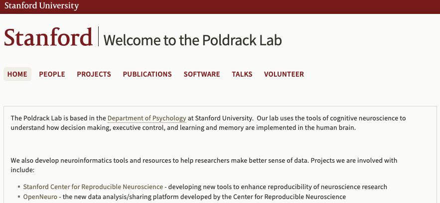
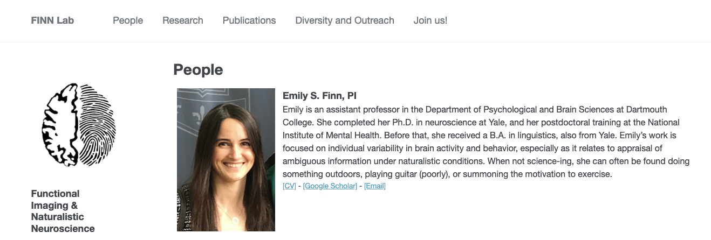
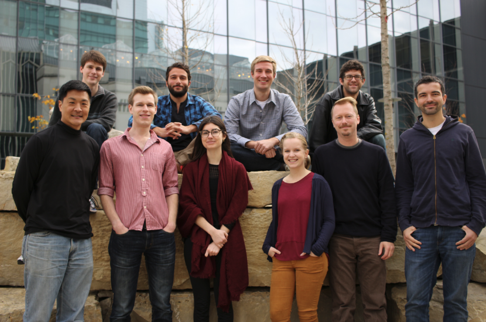
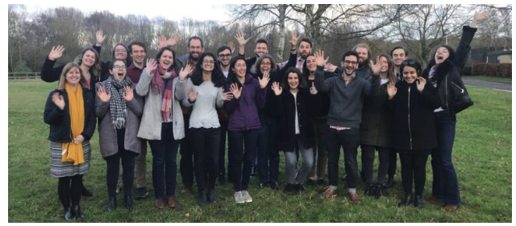

--- 
title: "YOUR TITLE HERE"
author: "YOUR NAMES HERE"
date: "`r Sys.Date()`"
site: bookdown::bookdown_site
---

# Target Universities

## Stanford University 

### _Poldrack Lab_

```{r, fig.cap="Poldrack Lab", echo=FALSE}

```
Lab Website: <https://poldracklab.stanford.edu/>

Principle Investigator: `Russell Poldrack`

Google Scholar Citation: `65008`

Post Open Positions: `NO`

Research Theme: `Our lab uses the tools of cognitive neuroscience to understand how decision making, executive control, and learning and memory are implemented in the human brain.`

### _Social Learning Lab_

```{r, fig.cap="Social Learning Lab", echo=FALSE}

```
Lab Website: <https://http://sll.stanford.edu/>

Principle Investigator: `Hyowon Gweon`

Google Scholar Citation: `2811`

Post Open Positions: `YES`

Research Theme: `We learn about the world by drawing rich, abstract inductive inferences that go beyond what we can observe, and much of these observations come from behaviors of others around us. By engaging in social learning in diverse contexts, humans learn from others, share their knowledge with others, and even accumulate a body of cultural knowledge over generations.`

## Dartmouth College

### Functional Imaging and Naturalistic Neuroscience Lab

```{r, fig.cap="Finn Lab", echo=FALSE}

```
Lab Website: <https://thefinnlab.github.io/>

Principle Investigator: `Emily S, Finn`

Google Scholar Citation: `4298`

Post Open Positions: `YES`

Research Theme: `What makes us unique? How do our intrinsic traits bias our perceptions and judgments, and how is this reflected in patterns of brain activity? Why might different people arrive at different interpretations of the same experience? My lab’s research combines behavioral, neuroimaging and computational techniques to study individual differences in cognition, especially under rich, dynamic, “naturalistic” stimulation such as watching movies or listening to stories. We are particularly interested in how individuals resolve ambiguity in narratives, and how this process varies with trait- and state-level factors.`

Representative Papers:

1. As professor:

    - Bandettini, P. A., Huber, L., & Finn, E. S. (2021). Challenges and opportunities of mesoscopic brain mapping with fMRI. Current Opinion in Behavioral Sciences, 40, 189-200.
    - Finn, E. S. (2021). Is it time to put rest to rest?. Trends in Cognitive Sciences.

1. As student:

    - **Finn ES**, Shen X, Scheinost D, Rosenberg MD, Huang J, Chun MM, Papademetris X, Constable RT. (2015) Functional connectome fingerprinting: Identifying individuals using patterns of brain connectivity. Nature Neuroscience, 18: 1664–1671.
    - Finn ES, Corlett PR, Chen G, Bandettini PA, Constable RT. (2018). Trait paranoia shapes inter-subject synchrony in brain activity during an ambiguous social narrative. Nature Communications, 9: 2043.
    - Finn ES, Huber L, Jangraw DC, Molfese PJ, Bandettini PA. (2019). Layer-dependent activity in human prefrontal cortex during working memory. Nature Neuroscience, 22: 1687–1695.
    

    
## Brown University

### Shenhav Lab

```{r, fig.cap="Shenhav Lab", echo=FALSE}
knitr::include_graphics("shenhavlab.png")
```
Lab Website: <https://www.shenhavlab.org/>

Principle Investigator: `Amitai Shenhav`

Google Scholar Citation: `5478`

Post Open Positions: `YES _(did not say whether should contact in email)_`

Research Theme: `**Decision-making** research focuses on how we deliberate over costs and benefits of our options (e.g., comparing apples & oranges). **Cognitive control** research focuses on how we exert cognitive effort to overcome our automatic biases (e.g., naming the color a word appears in vs. reading the word itself).`

Representative Papers:

1. As professor:

    - *Frömer, R, *Lin, H., Dean Wolf, C.K., Inzlicht, M. & Shenhav, A. (2021). Expectations of reward and efficacy guide cognitive control allocation. Nature Communications, 12: 1030.
    - Ritz, H., Frömer, R., & Shenhav, A. (2020). Bridging Motor and Cognitive Control: It’s About Time! Trends in Cognitive Sciences, 24(1): 6-8.
    - Frömer, R., Dean Wolf, C.K., & Shenhav, A. (2019). Goal congruency dominates reward value in accounting for behavioral and neural correlates of value-based decision-making. Nature Communications, 10(1): 4926.

1. As student:

    - Shenhav, A., Botvinick, M.M., & Cohen, J.D. (2016). Dorsal anterior cingulate cortex and the value of control. Nature Neuroscience 19(10): 1286-1291.
    - Shenhav, A., Straccia, M.A., Cohen, J.D., & Botvinick, M.M. (2014). Anterior cingulate engagement in a foraging context reflects choice difficulty, not foraging value. Nature Neuroscience 17(9): 1249-1254.

## University of Chicago

## Cognitive Neuroscience Lab

```{r, fig.cap="Awh Lab", echo=FALSE}

```
Lab Website: <https://awhvogellab.com/>

Principle Investigator: `Edward Awh`

Google Scholar Citation: `19158`

Post Open Positions: `NO`

Research Theme: `We study the interactions between visual working memory and selective attention using psychophysical and electrophysiological methods.`

Representative Papers:

1. As professor:

    - Feldmann-Wüstefeld, T., Weinberger, M., & Awh, E. (2021). Spatially guided distractor suppression during visual search. Journal of Neuroscience, 41(14), 3180-3191.
    - Foster, J. J., Thyer, W., Wennberg, J. W., & Awh, E. (2021). Covert attention increases the gain of stimulus-evoked population codes. Journal of Neuroscience, 41(8), 1802-1815.
    - Sutterer, D. W., Foster, J. J., Adam, K. C., Vogel, E. K., & Awh, E. (2019). Item-specific delay activity demonstrates concurrent storage of multiple active neural representations in working memory. PLoS biology, 17(4), e3000239.
    - Foster, J. J., Bsales, E. M., Jaffe, R. J., & Awh, E. (2017). Alpha-band activity reveals spontaneous representations of spatial position in visual working memory. Current Biology, 27(20), 3216-3223.
    - Awh, E., Belopolsky, A. V., & Theeuwes, J. (2012). Top-down versus bottom-up attentional control: A failed theoretical dichotomy. Trends in cognitive sciences, 16(8), 437-443.
    
1. As student:

    - Awh, E., & Jonides, J. (2001). Overlapping mechanisms of attention and spatial working memory. Trends in cognitive sciences, 5(3), 119-126.
    - Awh, E., Jonides, J., Smith, E. E., Schumacher, E. H., Koeppe, R. A., & Katz, S. (1996). Dissociation of storage and rehearsal in verbal working memory: Evidence from positron emission tomography. Psychological Science, 7(1), 25-31.
    - Awh, E., Belopolsky, A. V., & Theeuwes, J. (2012). Top-down versus bottom-up attentional control: A failed theoretical dichotomy. Trends in cognitive sciences, 16(8), 437-443.
    
## Oxford University

### ACClab

```{r, fig.cap="ACClab", echo=FALSE}
knitr::include_graphics("acclab.png")
```
Lab Website: <https://www.oxacclab.org/>

Principle Investigator: `Nick Yeung`

Google Scholar Citation: `14887`

Post Open Positions: `YES _(encourage contact)_`

Research Theme: `The broad question addressed in our research is how coherent thought and action emerge from processing in the brain. While much is now known about specific aspects of brain function—how we perceive the world, attend to particular details, remember facts and events, make decisions, etc.—much less is known about how these different functions become organised so that, at any given time, we can focus our attention on a particular task (or tasks) based on our current goals and intentions. Our research investigates the mechanisms responsible for imposing this organisation on our thoughts and actions. A key component of our research is the development of computational models of attention and control processes. We use these models to inform the design and interpretation of our empirical work that combines behavioural, functional neuroimaging (fMRI), and scalp electrophysiological (EEG) methods.`

Representative Papers:

1. As professor:

    - Frömer, R., Nassar, M. R., Bruckner, R., Stürmer, B., Sommer, W., & Yeung, N. (2021). Response-based outcome predictions and confidence regulate feedback processing and learning. Elife, 10, e62825.
    - Desender, K., Murphy, P., Boldt, A., Verguts, T., & Yeung, N. (2019). A postdecisional neural marker of confidence predicts Information-Seeking in Decision-Making. Journal of Neuroscience, 39(17), 3309-3319.
    - Sutterer, D. W., Foster, J. J., Adam, K. C., Vogel, E. K., & Awh, E. (2019). Item-specific delay activity demonstrates concurrent storage of multiple active neural representations in working memory. PLoS biology, 17(4), e3000239.
    - Desender, K., Boldt, A., & Yeung, N. (2018). Subjective confidence predicts information seeking in decision making. Psychological science, 29(5), 761-778.
    - Boldt, A., & Yeung, N. (2015). Shared neural markers of decision confidence and error detection. Journal of Neuroscience, 35(8), 3478-3484.
    
1. As student:

    - Yeung, N., Botvinick, M. M., & Cohen, J. D. (2004). The neural basis of error detection: conflict monitoring and the error-related negativity. Psychological review, 111(4), 931.
    - Yeung, N., & Sanfey, A. G. (2004). Independent coding of reward magnitude and valence in the human brain. Journal of Neuroscience, 24(28), 6258-6264.
    - Yeung, N., Holroyd, C. B., & Cohen, J. D. (2005). ERP correlates of feedback and reward processing in the presence and absence of response choice. Cerebral cortex, 15(5), 535-544.
    
### Brain & Cognition Lab

```{r, fig.cap="Nobre Lab", echo=FALSE}

```
Lab Website: <https://www.brainandcognition.org/>

Principle Investigator: `Kia Nobre`

Google Scholar Citation: `32459`

Post Open Positions: `YES _(encourage contact)_`

Research Theme: `Human behaviour is uniquely flexible. Our brains bring forth memories from moments to years ago, taking into account what matters in a given context, to guide our perception, choice, action, and learning. All of this happens in the flux of our ongoing interaction with the external environment and internal mindscape. In the lab, we are fascinated by this proactive and dynamic process of focus at the core of all cognition. We carry out many lines of research, but they share the broad aim of investigating the workings of mental focus and in understanding its role in psychological and brain disorders.`

Representative Papers:

1. Recent publication:

    - van Ede, F., Deden, J., & Nobre, A. C. (2021). Looking ahead in working memory to guide sequential behaviour. Current Biology, 31(12), R779-R780.
    - Draschkow, D., Kallmayer, M., & Nobre, A. C. (2021). When natural behavior engages working memory. Current Biology, 31(4), 869-874.
    - Van Ede, F., Board, A. G., & Nobre, A. C. (2020). Goal-directed and stimulus-driven selection of internal representations. Proceedings of the National Academy of Sciences, 117(39), 24590-24598.
    - Bauer, A. K. R., Debener, S., & Nobre, A. C. (2020). Synchronisation of neural oscillations and cross-modal influences. Trends in cognitive sciences, 24(6), 481-495.
    - Van Ede, F., Chekroud, S. R., & Nobre, A. C. (2019). Human gaze tracks attentional focusing in memorized visual space. Nature human behaviour, 3(5), 462-470.
    
1. Early period:

    - Nobre, A. C., Allison, T., & McCarthy, G. (1994). Word recognition in the human inferior temporal lobe. Nature, 372(6503), 260-263.
    - Nobre, A. C., Gitelman, D. R., Dias, E. C., & Mesulam, M. M. (2000). Covert visual spatial orienting and saccades: overlapping neural systems. Neuroimage, 11(3), 210-216.
    - Nobre, A. C., Coull, J. T., Frith, C. D., & Mesulam, M. M. (1999). Orbitofrontal cortex is activated during breaches of expectation in tasks of visual attention. Nature neuroscience, 2(1), 11-12.

